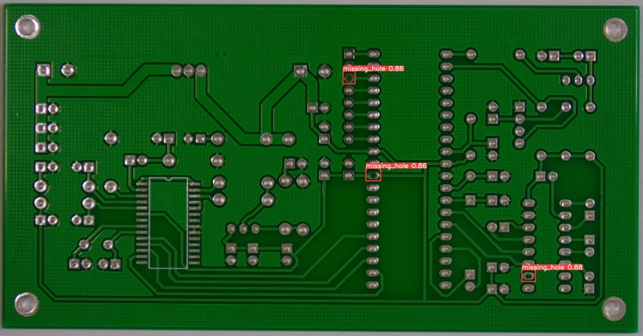
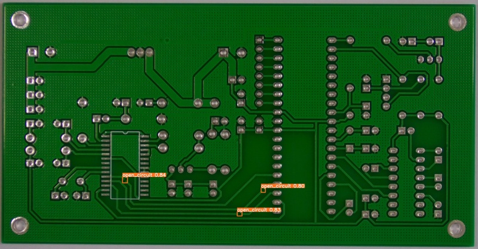
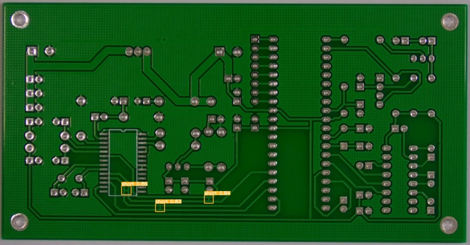

# PCB-Defect-Detection
此專案為使用YOLOv5偵測PCB板上的缺陷種類  
類別種類有missing hole, mouse bite, open circuit, short, spur, spurious copper

## 資料集
因為dataset的資料量比較少，所以透過資料增強(data augmentation)增加訓練用的數據，在資料增強的過程中，bbox會根據圖片的旋轉或縮放而自動調整，因此我們不需要額外花時間標記ground truth。
```
python aug_with_bbox.py
```

## 訓練
可以根據下面的連結自行訓練YOLOv5，操作很詳細也很清楚。  
https://tw511.com/a/01/29504.html

## 評估/檢測
您可以透過YOLOv5的*detect.py*自行輸出結果，為了後續的使用，也可以透過以下程式碼查看您的模型偵測的結果，此段程式碼取自YOLOv5的*detect.py*。  
```python
class PCB_Net:
    def __init__(self):
        self.weights = './yolov5-master/runs/train/exp3/weights/best.pt'
        self.device = select_device('')
        self.model = DetectMultiBackend(self.weights, device=self.device, dnn=False)
        self.stride, self.names, self.pt, self.jit, self.onnx = self.model.stride, self.model.names, self.model.pt, self.model.jit, self.model.onnx
        self.imgsz = check_img_size([640, 640], s=self.stride)
        self.visualize = False

        self.half = False
        self.half &= self.pt and self.device.type != 'cpu'
        if self.pt:
            self.model.model.half() if self.half else self.model.model.float()

        if self.pt and self.device.type != 'cpu':
            self.model(torch.zeros(1, 3, *self.imgsz).to(self.device).type_as(next(self.model.model.parameters())))

    def pcb_defect_detect(self, img_path):
        def detect(img_path):
            image = cv2.imread(img_path)
            dataset = LoadImages(img_path, img_size=self.imgsz, stride=self.stride, auto=self.pt and not self.jit)
            bs = 1
            vid_path, vid_writer = [None] * bs, [None] * bs

            dt, seen = [0.0, 0.0, 0.0], 0
            for path, im, im0s, vid_cap, s in dataset:
                im = torch.from_numpy(im).to(self.device)
                im = im.half() if self.half else im.float()
                im /= 255
                if len(im.shape) == 3:
                    im = im[None]

                save_dir = increment_path(Path('./add_datas') / 'exp', exist_ok=False)
                self.visualize = increment_path(save_dir / Path(path).stem, mkdir=True) if self.visualize else False
                pred = self.model(im, augment=False, visualize=self.visualize)
                pred = non_max_suppression(pred, 0.25, 0.45, None, False, max_det=1000)

                for i, det in enumerate(pred):
                    p, im0, frame = path, im0s.copy(), getattr(dataset, 'frame', 0)
                    if len(det):
                        det[:, :4] = scale_coords(im.shape[2:], det[:, :4], im0.shape).round()

                defect_bbox = []
                defect_classes = []
                pred = pred[0].tolist()
                for i in range(len(det)):
                    dett = det[i].tolist()
                    box = [int(dett[0]), int(dett[1]), int(dett[2]), int(dett[3])]
                    defect_bbox.append(box)
                    defect_classes.append(int(dett[5]))

                    #cv2.rectangle(image, (box[0], box[1]), (box[2], box[3]), (0, 255, 0), 2)
                #cv2.imwrite("./yolov5-master/runs/detect/output/{}".format(img_path.split("/")[-1]), image)

            return defect_bbox, defect_classes

        with torch.no_grad():
            defect_bbox, defect_classes = detect(img_path)
            return defect_bbox, defect_classes
```

## 結果



